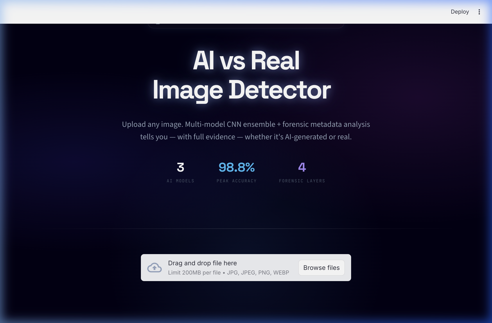
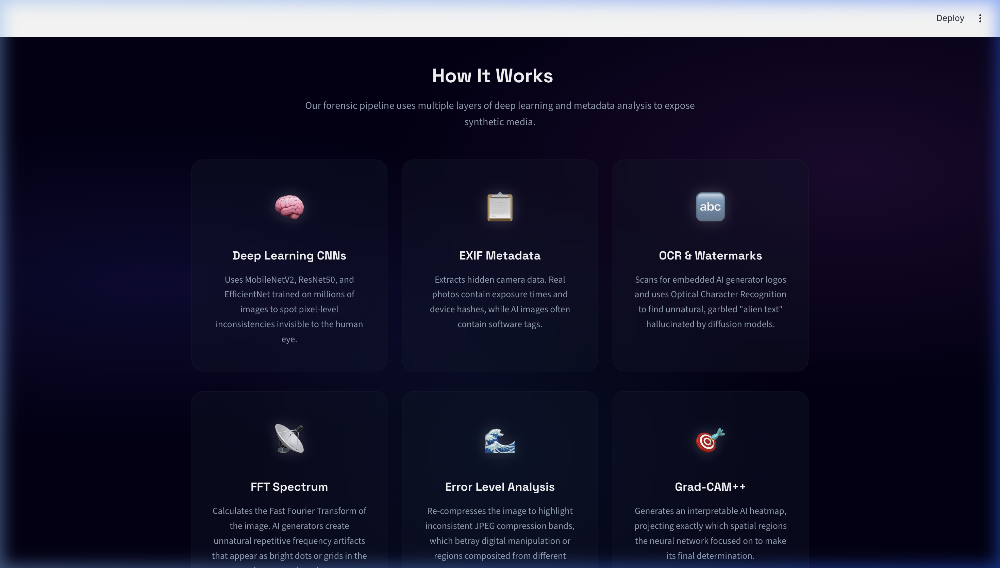

<div align="center">

<h1>
  <br>
  ForensIQ — AI Image Detector
</h1>

<p><strong>Is that image real or AI-generated? ForensIQ knows.</strong><br>
A multi-layer forensic intelligence engine that combines deep learning and classical digital forensics to detect AI-generated imagery with military-grade precision.</p>

[](https://share.streamlit.io/karthikeyachalla/forensiq-ai-image-detector)
[](LICENSE)
[](https://www.python.org/)
[](https://pytorch.org/)
[](https://streamlit.io/)

</div>

---

## 📸 Screenshots

<div align="center">

| Hero Interface | Forensic Features |
|:---:|:---:|
|  |  |

</div>

---

## 🔬 What is ForensIQ?

ForensIQ is a state-of-the-art **forensic AI image authentication tool** that goes far beyond a simple "AI detector". It uses a **multi-layer analysis pipeline** to give you a transparent, evidence-backed verdict:

| Layer | Technique | Purpose |
|---|---|---|
| 🧠 **CNN Classifier** | MobileNetV2 / ResNet50 / EfficientNetB0 | Core ~98.8% accuracy deep learning inference |
| 👁️ **Grad-CAM++** | Gradient-weighted Class Activation Mapping | Visual heatmap showing *why* the model decided |
| 📷 **EXIF Forensics** | Metadata parser with AI software fingerprinting | Detects missing camera hardware, AI tool signatures |
| 📉 **ELA Analysis** | Error Level Analysis | Detects JPEG re-compression artifacts |
| 📡 **FFT Frequency** | Fast Fourier Transform | Identifies GAN grid patterns in frequency domain |
| 🔤 **OCR Watermark** | Optical Character Recognition | Detects DALL·E, Midjourney, Stable Diffusion marks |

---

## 📂 Repository Structure

```
forensiq-ai-image-detector/
│
├── 📁 docs/                    # Documentation & screenshots
│   ├── PRD.md                  # Product Requirements Document
│   ├── TDD.md                  # Technical Design Document
│   ├── screenshot_hero.png     # Main UI screenshot
│   └── screenshot_features.png # Features screenshot
│
├── 📁 models/                  # Trained CNN model weights (.pth)
│   ├── mobilenet_balanced.pth
│   ├── efficientnet_balanced.pth
│   └── resnet50_balanced.pth
│
├── 📁 notebooks/               # Model training Jupyter notebooks
│   ├── EfficientNetB0.ipynb
│   ├── MobilenetV2_Test.ipynb
│   ├── ResNet50_Test.ipynb
│   └── Main_model.ipynb
│
├── 📁 .streamlit/              # Streamlit Cloud configuration
│   └── config.toml
│
├── app.py                      # 🚀 Main Streamlit application
├── requirements.txt            # Python dependencies
├── LICENSE                     # MIT License
└── README.md
```

---

## 📊 Model Performance

| Model | Test Accuracy | AI Precision | Real Precision |
|---|---|---|---|
| **MobileNetV2** | 🥇 **98.81%** | 0.99 | 0.99 |
| **ResNet50** | 🥇 **98.81%** | 0.99 | 0.99 |
| **EfficientNetB0** | 97.27% | 0.98 | 0.96 |

*Evaluated on a balanced dataset of 1,426 images (744 AI-generated, 682 real).*

---

## 🚀 Run Locally

### 1. Clone the repository
```bash
git clone https://github.com/karthikeyachalla/forensiq-ai-image-detector.git
cd forensiq-ai-image-detector
```

### 2. Install dependencies
```bash
pip install -r requirements.txt
```

### 3. Launch the app
```bash
streamlit run app.py
```

*Opens in your browser at `http://localhost:8501`*

---

## ☁️ Deploy to Streamlit Cloud (1-click)

1. Fork this repository.
2. Go to **[share.streamlit.io](https://share.streamlit.io)**.
3. Click **New App** → Select this repository → Set main file: `app.py`.
4. Click **Deploy!** — your app is live!

> ⚠️ **Note on models:** The `.pth` weight files are excluded from Git for size. Download them and place them in the `models/` folder, or host them on a cloud bucket.

---

## 🛠️ Tech Stack

- **Frontend/Backend:** Streamlit
- **ML Framework:** PyTorch + Torchvision
- **Computer Vision:** OpenCV, Pillow, NumPy
- **Explainable AI:** Grad-CAM++
- **Signal Analysis:** SciPy (FFT), ELA

---

## 📄 Documentation

| Document | Description |
|---|---|
| [📋 PRD.md](docs/PRD.md) | Product Requirements Document |
| [🔧 TDD.md](docs/TDD.md) | Technical Design Document |

---

## 📜 License

This project is licensed under the [MIT License](LICENSE) — free for personal and commercial use.

---

## 👤 Author

**Karthikeya Challa**  
[](https://github.com/karthikeyachalla)

*Original model training credits: Pothuri Indraneel*

---

<div align="center">
⭐ If you found this useful, please star the repository!
</div>
